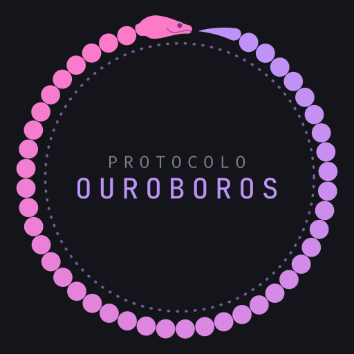

# Ouroboros Mobile

App Android pessoal para captura ativa em Vault Obsidian compartilhado
entre duas pessoas. Mobile escreve `.md`; o pipeline desktop
[`protocolo-ouroboros`](https://github.com/[REDACTED]/protocolo-ouroboros)
processa. Construído com Expo + React Native, sem rede de saída,
estética premium nativa desde o dia um.

## Marca

<p align="center">
  
</p>

A serpente que morde a própria cauda: 43 contas num degradê de rosa a
roxo, o ciclo que se fecha e recomeça. O mesmo glifo canônico alimenta o
ícone do launcher, o splash e a logo in-app
([`src/components/brand/OuroborosLogo.tsx`](src/components/brand/OuroborosLogo.tsx)),
todos gerados por
[`scripts/gen-brand-assets.sh`](scripts/gen-brand-assets.sh) a partir de
um único SVG-fonte. "Protocolo Ouroboros" é o nome do produto.

## Status

Pré-1.0 em desenvolvimento. Distribuição manual: APK assinado instalado
diretamente nos celulares, sem Play Store e sem auto-update. Cada release
é distribuição deliberada. Veja [`docs/RELEASE.md`](docs/RELEASE.md) para o
pipeline completo (build EAS production → AAB → APK universal → tag git).

## Stack

Expo SDK 54 · React Native 0.81 · TypeScript strict · NativeWind 4 ·
Moti · Reanimated 4 · gluestack-ui · @gorhom/bottom-sheet · zustand ·
zod · JetBrains Mono.

## Setup rápido

```bash
git clone https://github.com/[REDACTED]/ouroboros-mobile.git
cd ouroboros-mobile
./install.sh        # instala dependências, hooks de git e pessoas.config
./run.sh            # inicia Metro com IP da WiFi e gera QR code
```

Escaneie o QR no Expo Go do celular Android (mesma rede WiFi). Fast
refresh em menos de 1 segundo, sem build de Android Studio.

### Quando usar cada um

| Comando | Para que | Dependências |
|---|---|---|
| `./gauntlet.sh` | Validação visual web rápida (UI, CSS, routing) | Nenhuma (Chrome) |
| `./run.sh` | Teste nativo no celular físico | Wi-Fi + QR code |
| `./run.sh --emulator` | Teste nativo no emulador Android | AVD configurado |

## Scripts

| Script | Função |
|---|---|
| `./install.sh` | Setup do projeto: confere Node 20+, instala deps com `--legacy-peer-deps`, configura hooks, cria `pessoas.config.ts`, valida com smoke. |
| `./install-dev.sh` | Setup do desktop em uma passada: pede sudo só uma vez, instala ADB, scrcpy, Android cmdline-tools, system image e emulador. Configura `~/.zshrc` com `ANDROID_HOME` e PATH. Cria AVD `ouroboros-test` otimizado por hardware (cores, RAM, GPU host, KVM) e snapshot inicial pra boot <10s. Default sem flags instala tudo. `--skip-emulator` para só ADB+scrcpy. |
| `./run.sh` | Inicia Metro com QR. Flags: `--clear` (limpa cache), `--tunnel` (ngrok), `--web` (Chrome desktop, zero conflito com celular), `--emulator` (sobe AVD `ouroboros-test` antes do Metro), `--mirror` (abre janela scrcpy do device conectado em paralelo). |
| `./scripts/start-emulator.sh` | Inicia emulador `ouroboros-test` com flags de performance (`-gpu host`, `-accel auto`, snapshot). `--headless` para sem janela, `--cold` para ignorar snapshot. |
| `./scripts/mirror-device.sh` | Abre `scrcpy` espelhando celular físico ou emulador. Latência <50ms. |
| `./uninstall.sh` | Apaga `node_modules`, `.expo`, caches. Não toca em `.git`, código, `pessoas.config.ts` nem no Vault. |
| `./scripts/smoke.sh` | Roda anonimato + dados de teste + typecheck + lint + tests. Usado pelo pre-push. |
| `./scripts/check_anonimato.sh` | Valida Regra −1: zero atribuição de autoria, zero nomes reais hardcoded. Roda no pre-commit. |
| `./scripts/adb-wireless.sh` | Habilita ADB sem cabo após pareamento USB inicial. Gerado pelo `install-dev.sh`. |

## Política de validação visual (3 níveis)

- **Nível A** (default): `./run.sh --web` + Chrome no desktop. Cobre fluxos JS, sem conflito com seu celular.
- **Nível B** (sob demanda): emulador Android no desktop (instalado pelo `install-dev.sh`). Cobre APIs nativas.
- **Nível C** (precisa sua permissão): celular físico via ADB. Só para Syncthing real, share intent de outros apps e checkpoint visual de fim de sprint.

## Documentação

- [`docs/BRIEFING.md`](docs/BRIEFING.md) — design system, princípios estéticos, telas, schemas
- [`docs/CONTEXTO.md`](docs/CONTEXTO.md) — ecossistema, regras invioláveis, anonimato
- [`docs/FEATURES-CANONICAS.md`](docs/FEATURES-CANONICAS.md) — mapa funcional do app (fonte de verdade de features)
- [`docs/ADRs/`](docs/ADRs/) — Architecture Decision Records
- [`docs/RELEASE.md`](docs/RELEASE.md) — pipeline de release
- [`docs/SECURITY.md`](docs/SECURITY.md) — política de segurança e anti-leak
- [`docs/OAUTH-SETUP.md`](docs/OAUTH-SETUP.md) — configuração OAuth Google

## Filosofia

- **Baixa fricção.** 1-2 taps para registrar qualquer coisa.
- **Nada de gamificação.** Sem streaks, badges, reforço positivo artificial.
- **Dados são arquivos.** Tudo `.md` no Vault. Portável, auditável.
- **Mobile captura, desktop processa.** Não duplica funcionalidade.
- **Estética é função.** Beleza não é adorno; é ferramenta para reduzir a fricção de abrir.
- **Sem rede de saída.** Zero analytics, zero crash reporter remoto. Tudo on-device.

Detalhes em `docs/BRIEFING.md` Seção 1 e 2.

## Licença

GPL-3.0 — ver [`LICENSE`](LICENSE).
